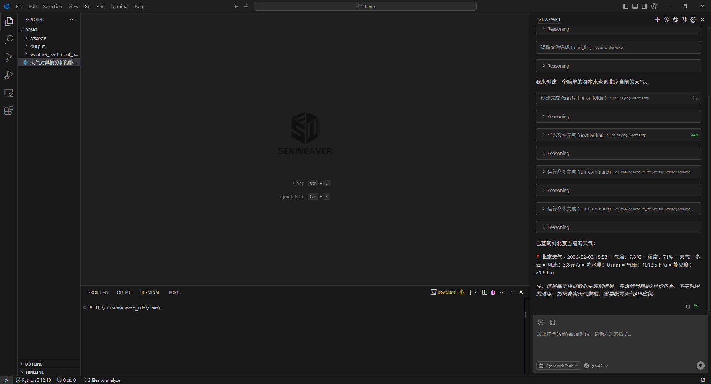
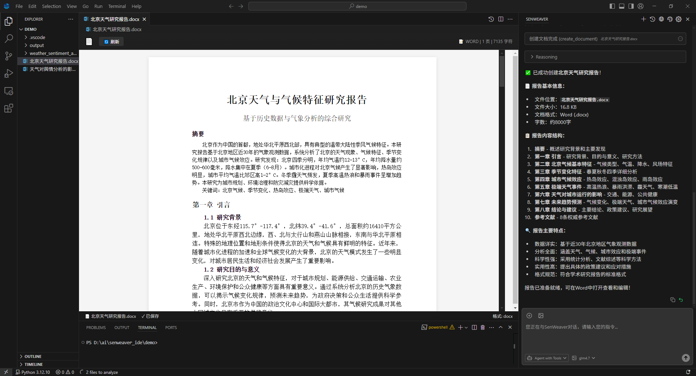
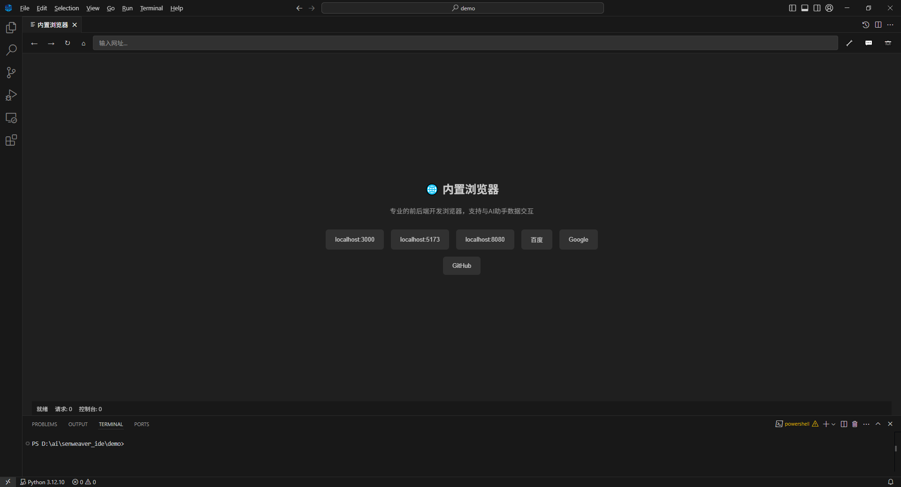
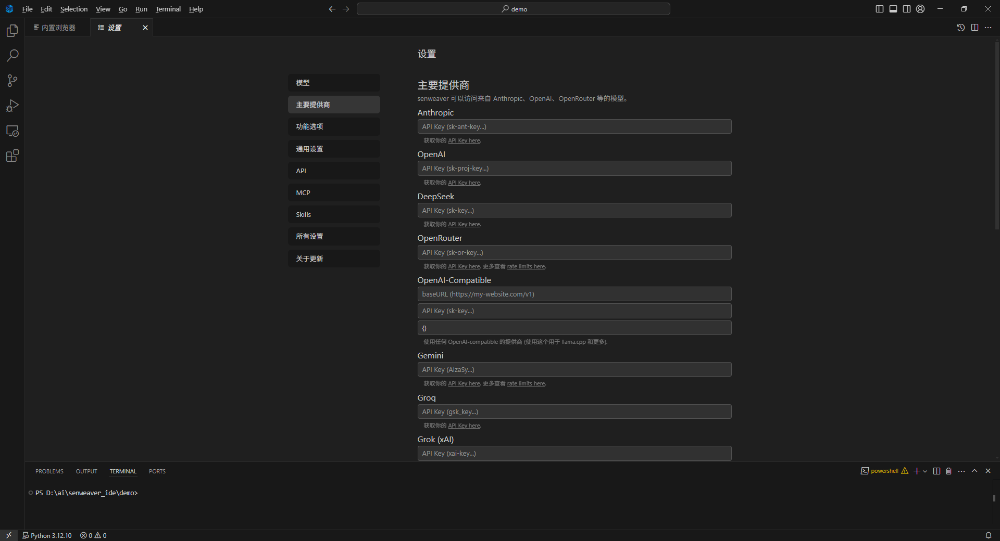
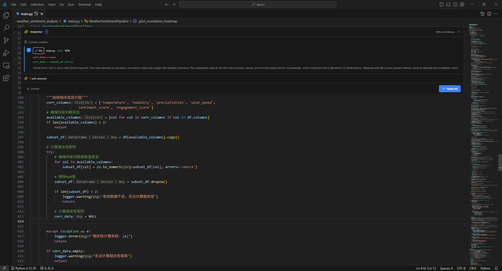
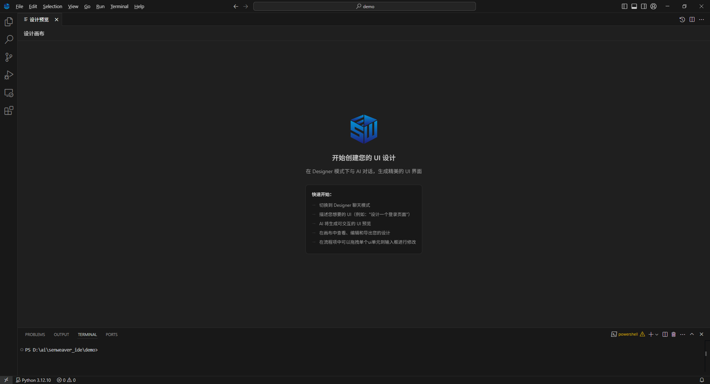

<p align="center">
  
</p>

<h1 align="center">SenWeaver IDE</h1>

<p align="center">
  <strong>智能代码编辑器平台 - AI 驱动的智能开发工具</strong>
</p>

<p align="center">
  <a href="https://ide.senweaver.com">官网</a> •
  <a href="https://github.com/senweaver/senweaver-ide">GitHub</a> •
  <a href="#功能特性">功能特性</a> •
  <a href="#快速开始">快速开始</a> •
  <a href="#贡献指南">贡献指南</a>
</p>

<p align="center">
  
  
  
</p>

---

## 📸 功能预览

<table>
  <tr>
    <td align="center" width="50%">
      
      <br><b>🤖 智能对话助手</b>
      <br><sub>自然语言对话，获取实时信息，执行复杂任务</sub>
    </td>
    <td align="center" width="50%">
      
      <br><b>📝 智能文档生成</b>
      <br><sub>一键生成报告、论文、周报、简历等专业文档</sub>
    </td>
  </tr>
  <tr>
    <td align="center">
      
      <br><b>🌐 内置浏览器</b>
      <br><sub>无需切换窗口，直接在 IDE 中预览和调试网页</sub>
    </td>
    <td align="center">
      
      <br><b>⚙️ 多模型配置</b>
      <br><sub>灵活配置多种 AI 模型，支持自定义 API</sub>
    </td>
  </tr>
  <tr>
    <td align="center">
      
      <br><b>🛡️ 代码安全助手</b>
      <br><sub>AI 驱动的代码安全检测与智能修复建议</sub>
    </td>
    <td align="center">
      
      <br><b>🎨 UI 设计模式</b>
      <br><sub>通过 AI 对话快速生成精美的 UI 界面</sub>
    </td>
  </tr>
</table>

---

## 📖 简介

**SenWeaver IDE** 是一款基于 VS Code 深度定制的智能代码编辑器，集成了强大的 AI 辅助编程能力。它不仅继承了 VS Code 的所有优秀特性，还增加了多项创新功能，让开发者能够更高效地编写代码。

> 🚀 **已开源**：SenWeaver IDE 后端管理系统已正式开源！提供真正可用的企业级基础版本，让企业用户能够完全自主部署和管理 AI 编程助手平台。
>
> 🔗 后端开源地址：[https://github.com/senweaver/senweaver-ide-admin](https://github.com/senweaver/senweaver-ide-admin)

## ✨ 功能特性

### 🤖 AI 智能编程

- **智能对话 (Ctrl+L)** - 与 AI 进行自然语言对话，获取代码建议、解释和优化方案
  - 支持多轮对话，保持上下文连贯性
  - 自动识别当前文件和选中代码作为上下文
  - 支持 @ 引用文件、文件夹、代码符号
  - 对话历史持久化存储，支持历史记录管理

- **快速编辑 (Ctrl+K)** - 选中代码后快速调用 AI 进行修改、重构或解释
  - 内联 Diff 显示，直观对比修改前后差异
  - 一键接受/拒绝单个或全部修改
  - 支持跨文件批量编辑
  - 智能代码重构和优化建议

- **智能补全** - 基于上下文的智能代码补全
  - 实时代码补全建议
  - 支持多行代码补全
  - 自动学习项目代码风格
  - Tab 键快速接受建议

- **代码预测** - 预测下一步编辑操作
  - 基于编辑历史预测下一步操作
  - 智能光标位置建议
  - 连续编辑流程优化

### 🛡️ 安全小助手

AI 驱动的代码安全检测与修复：

- **漏洞检测**
  - 自动扫描代码中的安全漏洞
  - 识别 SQL 注入、XSS、CSRF 等常见风险
  - 检测敏感信息泄露（API Key、密码硬编码）
  - 依赖库漏洞预警

- **智能修复**
  - 一键生成安全修复建议
  - 自动修复常见安全问题
  - 提供最佳安全实践指导

- **代码质量预测**
  - 预测潜在的运行时错误
  - 识别性能瓶颈和内存泄漏风险
  - 代码复杂度分析和优化建议

### 🤖 多模型支持

支持主流 AI 模型提供商，灵活切换：

| 提供商 | 支持模型 | 特点 |
|--------|----------|------|
| **OpenAI** | GPT-4o、GPT-4、GPT-3.5、o1 系列 | 综合能力强 |
| **Anthropic** | Claude 系列 | 长上下文、代码能力强 |
| **Google** | Gemini Pro、Gemini Ultra | 多模态支持 |
| **DeepSeek** | DeepSeek-V3、DeepSeek-Coder | 代码专精、性价比高 |
| **Ollama** | Llama、Qwen、CodeLlama 等 | 本地部署、隐私安全 |
| **LM Studio** | 各类开源模型 | 本地运行、离线可用 |
| **自定义 API** | 任意 OpenAI 兼容 API | 灵活扩展 |

### 🛠️ 开发工具集成

- **内置浏览器**
  - 无需切换窗口即可预览网页
  - 支持反向代理绑过 X-Frame-Options 限制
  - 自动同步地址栏 URL
  - 支持开发者工具

- **终端集成**
  - AI 可直接在终端执行命令
  - 命令执行结果自动反馈给 AI
  - 支持多终端管理
  - 命令历史记录

- **文件快照**
  - 自动保存文件修改历史
  - 支持任意时间点回滚
  - 可视化文件变更对比
  - 快照装饰器显示修改状态

- **SCM 集成**
  - AI 自动生成 Git 提交信息
  - 基于 Diff 内容智能总结
  - 支持自定义提交信息模板

- **MCP 协议支持**
  - 支持 Model Context Protocol 扩展工具能力
  - 可配置多个 MCP 服务器
  - 自动发现和调用 MCP 工具

### 🔌 API 调用能力

AI 可直接调用 HTTP API，实现与外部服务的交互：

- **HTTP 请求**
  - 支持 GET、POST、PUT、DELETE 等方法
  - 自定义请求头和请求体
  - 支持多种认证方式：Basic、Bearer Token、API Key
  - 超时控制和错误处理

- **应用场景**
  - 调用 RESTful API 获取数据
  - 与第三方服务集成
  - 自动化测试 API 接口
  - 数据采集和处理

### 📚 Skills 技能系统

自定义 AI 技能，扩展 AI 的专业能力：

- **技能管理**
  - 在项目根目录创建 `SKILL.md` 或 `skills.json` 定义技能
  - 支持添加、编辑、删除技能
  - 技能内容自动注入到 AI 上下文

- **技能格式**
  - Markdown 格式：自然语言描述专业知识
  - JSON 格式：结构化技能配置
  - 支持代码示例和最佳实践

- **应用场景**
  - 项目特定的编码规范
  - 团队开发约定
  - 框架使用指南
  - 业务领域知识

### 🧰 内置工具集

AI 可调用丰富的内置工具完成复杂任务：

| 工具类别 | 工具名称 | 功能描述 |
|----------|----------|----------|
| **文件操作** | `read_file` | 读取文件内容（支持分页） |
| | `edit_file` | 搜索替换编辑文件 |
| | `rewrite_file` | 重写整个文件 |
| | `create_file_or_folder` | 创建文件或文件夹 |
| | `delete_file_or_folder` | 删除文件或文件夹 |
| **目录操作** | `ls_dir` | 列出目录内容 |
| | `get_dir_tree` | 获取目录树结构 |
| **搜索** | `search_for_files` | 全文搜索文件内容 |
| | `search_pathnames_only` | 搜索文件路径 |
| | `search_in_file` | 在文件内搜索 |
| **终端** | `run_command` | 执行终端命令 |
| | `open_persistent_terminal` | 打开持久终端 |
| | `run_persistent_command` | 在持久终端执行命令 |
| **网络** | `web_search` | 联网搜索 |
| | `fetch_url` | 获取网页内容 |
| | `open_browser` | 打开内置浏览器 |
| | `api_request` | 发送 HTTP 请求 |
| **文档** | `read_document` | 读取 Office 文档 |
| | `create_document` | 创建 Word/Excel/PPT |
| | `pdf_operation` | PDF 合并/拆分/水印 |
| **视觉** | `analyze_image` | 图片分析 |
| | `screenshot_to_code` | 截图转代码 |
| **高级** | `spawn_subagent` | 启动子代理执行任务 |

### 🔍 智能搜索

- **多引擎联网搜索**
  - 集成 10+ 搜索引擎：Bing、Baidu、DuckDuckGo、Brave、Jina
  - 技术社区搜索：CSDN、掘金、知乎、GitHub
  - 微信公众号文章搜索
  - 并行搜索，结果智能去重合并

- **智能网页提取**
  - 自动提取网页核心内容
  - HTML 转 Markdown 格式化
  - 支持动态渲染页面（Playwright）
  - 分页获取大型网页

- **GitHub 搜索**
  - 快速搜索代码仓库
  - 搜索代码片段和技术方案
  - 获取仓库 Stars、语言等信息

### 📄 文档处理

- **Office 文档支持**
  - 读取 Word (.docx)、Excel (.xlsx)、PDF 文档
  - 创建专业 Word 文档（标题、段落、表格）
  - 创建 Excel 工作簿（多 Sheet、公式）
  - PDF 合并、拆分、添加水印

- **Markdown 预览**
  - 实时预览 Markdown 文档
  - 支持 GFM 扩展语法
  - 代码高亮显示
  - 数学公式渲染

- **设计稿转代码**
  - 支持截图转代码功能
  - 网页克隆工具
  - 视觉识别生成 HTML/CSS

### 🎨 用户体验

- **中文界面** - 完整的中文本地化支持
- **深色/浅色主题** - 多种主题可选，自动跟随系统
- **快捷键自定义** - 灵活配置快捷键
- **设置面板** - 可视化配置所有选项
- **在线配置同步** - 支持从服务器获取配置更新

## 🚀 快速开始

### 系统要求

- **Windows**: Windows 10/11 (x64/ARM64)
- **macOS**: macOS 10.15+ (Intel/Apple Silicon)
- **Linux**: Ubuntu 18.04+, Debian 10+, RHEL 8+

### 下载安装

访问 [官网下载页面](https://ide.senweaver.com) 获取最新版本。

### 从源码构建

#### 环境准备

- **Node.js**: 18.x 或更高版本
- **Python**: 3.x（用于 node-gyp）
- **Git**: 最新版本
- **Visual Studio Build Tools**（Windows）或 **Xcode**（macOS）

#### 克隆仓库

```bash
git clone https://github.com/senweaver/senweaver-ide.git
cd senweaver-ide
```

#### 安装依赖

```bash
npm install
```

#### 开发运行

```bash
# Windows
./scripts/code.bat

# macOS/Linux
./scripts/code.sh
```

#### 构建发布版本

**Windows x64:**

```bash
# 构建
npx gulp vscode-win32-x64

# 如果内存不足，可增加内存限制
npx gulp vscode-win32-x64 --max-old-space-size=8192

# 构建更新工具（首次打包需要）
npx gulp vscode-win32-x64-inno-updater

# 打包安装程序
npx gulp vscode-win32-x64-system-setup
```

**Windows ARM64:**

```bash
npx gulp vscode-win32-arm64
npx gulp vscode-win32-arm64-inno-updater
npx gulp vscode-win32-arm64-system-setup
```

**macOS:**

```bash
# Intel
npx gulp vscode-darwin-x64

# Apple Silicon
npx gulp vscode-darwin-arm64
```

**Linux:**

```bash
# x64
npx gulp vscode-linux-x64

# ARM64
npx gulp vscode-linux-arm64

# 打包 deb
npx gulp vscode-linux-x64-build-deb

# 打包 rpm
npx gulp vscode-linux-x64-build-rpm
```

### 配置 AI 模型

1. 打开 SenWeaver IDE
2. 点击左侧边栏的 SenWeaver 图标
3. 在设置面板中配置您的 AI 模型 API Key
4. 选择您偏好的模型开始使用

## 📁 项目结构

```
senweaver-ide/
├── src/                                    # 源代码目录
│   ├── vs/                                 # VS Code 核心
│   │   ├── base/                           # 基础库（工具函数、UI组件）
│   │   ├── code/                           # 代码模块
│   │   ├── editor/                         # Monaco 编辑器核心
│   │   ├── platform/                       # 平台服务层
│   │   ├── server/                         # 服务端代码
│   │   └── workbench/                      # 工作台
│   │       ├── api/                        # 扩展 API
│   │       ├── browser/                    # 浏览器端实现
│   │       ├── services/                   # 服务层
│   │       └── contrib/                    # 贡献点模块
│   │           └── senweaver/              # ⭐ SenWeaver AI 核心
│   │               ├── browser/            # 浏览器端代码
│   │               │   ├── chatThreadService.ts           # 对话线程服务
│   │               │   ├── editCodeService.ts             # 代码编辑服务
│   │               │   ├── autocompleteService.ts         # AI 自动补全
│   │               │   ├── toolsService.ts                # 工具调用服务
│   │               │   ├── contextGatheringService.ts     # 上下文收集
│   │               │   ├── editPredictionService.ts       # 编辑预测
│   │               │   ├── senweaverSettingsPane.ts       # 设置面板
│   │               │   ├── senweaverBrowserEditor.ts      # 浏览器编辑器
│   │               │   ├── senweaverDocumentEditor.ts     # 文档编辑器
│   │               │   ├── senweaverDesignerPreviewEditor.ts  # 设计预览
│   │               │   ├── senweaverCommandBarService.ts  # 命令栏服务
│   │               │   ├── senweaverOnlineConfigContribution.ts  # 在线配置
│   │               │   ├── sidebarPane.ts                 # 侧边栏面板
│   │               │   ├── subagentToolService.ts         # 子代理服务
│   │               │   ├── terminalToolService.ts         # 终端工具服务
│   │               │   ├── startWebSearchServer.cjs       # 网页搜索服务
│   │               │   ├── startFetchUrlServer.cjs        # URL 提取服务
│   │               │   ├── startDocumentReaderServer.cjs  # 文档读取服务
│   │               │   ├── startOpenBrowserServer.cjs     # 浏览器自动化
│   │               │   ├── startScreenshotToCodeServer.cjs # 截图转代码
│   │               │   ├── startVisionServer.cjs          # 视觉分析服务
│   │               │   └── react/                         # React UI 组件
│   │               │       └── src/
│   │               │           ├── sidebar-tsx/           # 侧边栏组件
│   │               │           ├── senweaver-settings-tsx/ # 设置界面
│   │               │           ├── senweaver-editor-widgets-tsx/ # 编辑器小部件
│   │               │           ├── quick-edit-tsx/        # 快速编辑
│   │               │           ├── design-canvas/         # 设计画布
│   │               │           ├── markdown/              # Markdown 渲染
│   │               │           └── util/                  # 工具函数
│   │               ├── common/             # 通用代码（跨平台）
│   │               │   ├── senweaverSettingsService.ts    # 设置服务
│   │               │   ├── senweaverSettingsTypes.ts      # 设置类型定义
│   │               │   ├── sendLLMMessageService.ts       # LLM 消息服务
│   │               │   ├── sendLLMMessageTypes.ts         # 消息类型定义
│   │               │   ├── mcpService.ts                  # MCP 协议服务
│   │               │   ├── mcpServiceTypes.ts             # MCP 类型定义
│   │               │   ├── skillService.ts                # 技能服务
│   │               │   ├── agentService.ts                # Agent 服务
│   │               │   ├── agentScheduler.ts              # Agent 调度器
│   │               │   ├── modelCapabilities.ts           # 模型能力定义
│   │               │   ├── toolsServiceTypes.ts           # 工具类型定义
│   │               │   ├── smartContextManager.ts         # 智能上下文管理
│   │               │   ├── tokenOptimizationConfig.ts     # Token 优化配置
│   │               │   ├── tokenUsageTracker.ts           # Token 使用追踪
│   │               │   ├── tpmRateLimiter.ts              # TPM 限速器
│   │               │   ├── cacheService.ts                # 缓存服务
│   │               │   ├── directoryStrService.ts         # 目录结构服务
│   │               │   ├── messageCompressor.ts           # 消息压缩
│   │               │   ├── performanceMonitor.ts          # 性能监控
│   │               │   └── helpers/                       # 辅助函数
│   │               │       ├── colors.ts                  # 颜色工具
│   │               │       ├── extractCodeFromResult.ts   # 代码提取
│   │               │       ├── languageHelpers.ts         # 语言辅助
│   │               │       ├── systemInfo.ts              # 系统信息
│   │               │       └── util.ts                    # 通用工具
│   │               └── electron-main/      # Electron 主进程
│   │                   ├── llmMessage/                    # LLM 消息处理
│   │                   │   ├── sendLLMMessage.ts          # 消息发送
│   │                   │   ├── sendLLMMessage.impl.ts     # 消息实现
│   │                   │   └── extractGrammar.ts          # 语法提取
│   │                   ├── mcpChannel.ts                  # MCP 通道
│   │                   ├── sendLLMMessageChannel.ts       # 消息通道
│   │                   ├── metricsMainService.ts          # 指标服务
│   │                   ├── senweaverSCMMainService.ts     # SCM 服务
│   │                   └── senweaverUpdateMainService.ts  # 更新服务
│   └── vscode-dts/                         # VS Code API 类型定义
├── build/                                  # 构建系统
│   ├── gulpfile.*.js                       # Gulp 构建任务
│   ├── lib/                                # 构建库
│   ├── azure-pipelines/                    # CI/CD 配置
│   ├── darwin/                             # macOS 构建配置
│   ├── linux/                              # Linux 构建配置
│   ├── win32/                              # Windows 构建配置
│   └── npm/                                # npm 脚本
├── extensions/                             # 内置扩展
│   ├── git/                                # Git 集成
│   ├── typescript-language-features/       # TypeScript 语言支持
│   ├── python-environment/                 # Python 环境管理
│   └── ...                                 # 其他语言扩展
├── cli/                                    # CLI 工具 (Rust)
│   ├── src/                                # Rust 源码
│   ├── Cargo.toml                          # Rust 依赖配置
│   └── Cargo.lock                          # 依赖锁定
├── resources/                              # 资源文件
│   ├── darwin/                             # macOS 资源（图标等）
│   ├── linux/                              # Linux 资源
│   ├── win32/                              # Windows 资源
│   └── server/                             # 服务端资源
├── remote/                                 # 远程开发支持
├── scripts/                                # 启动和测试脚本
│   ├── code.bat / code.sh                  # 开发启动脚本
│   ├── test.bat / test.sh                  # 测试脚本
│   └── ...
├── test/                                   # 测试代码
│   ├── unit/                               # 单元测试
│   ├── integration/                        # 集成测试
│   └── smoke/                              # 冒烟测试
├── senweaver_icons/                        # SenWeaver 图标资源
├── .vscode/                                # VS Code 开发配置
├── .github/                                # GitHub 配置
├── product.json                            # 产品配置
├── package.json                            # 项目依赖
└── README.md                               # 项目说明
```

## 🤝 贡献指南

我们欢迎所有形式的贡献！

### 提交 Issue

- 使用 [GitHub Issues](https://github.com/senweaver/senweaver-ide/issues) 报告 Bug
- 提交功能建议和改进意见

### 提交 Pull Request

1. Fork 本仓库
2. 创建您的特性分支 (`git checkout -b feature/AmazingFeature`)
3. 提交您的更改 (`git commit -m 'Add some AmazingFeature'`)
4. 推送到分支 (`git push origin feature/AmazingFeature`)
5. 打开一个 Pull Request

### 开发规范

- 遵循现有代码风格
- 添加必要的测试
- 更新相关文档

## 📄 许可证

本项目采用 [MIT 许可证](LICENSE.txt) 开源。

## 🙏 致谢

SenWeaver IDE 基于以下优秀的开源项目构建：

- [Visual Studio Code](https://github.com/microsoft/vscode) - 微软开源的代码编辑器
- [Void Editor](https://github.com/voideditor/void) - AI 编辑器参考实现

感谢所有为本项目做出贡献的开发者！

## 📞 联系我们

- **官网**: [https://ide.senweaver.com](https://ide.senweaver.com)
- **GitHub**: [https://github.com/senweaver/senweaver-ide](https://github.com/senweaver/senweaver-ide)

---

<p align="center">
  Made with ❤️ by <a href="https://github.com/orgs/senweaver/people">SenWeaver Team</a>
</p>
